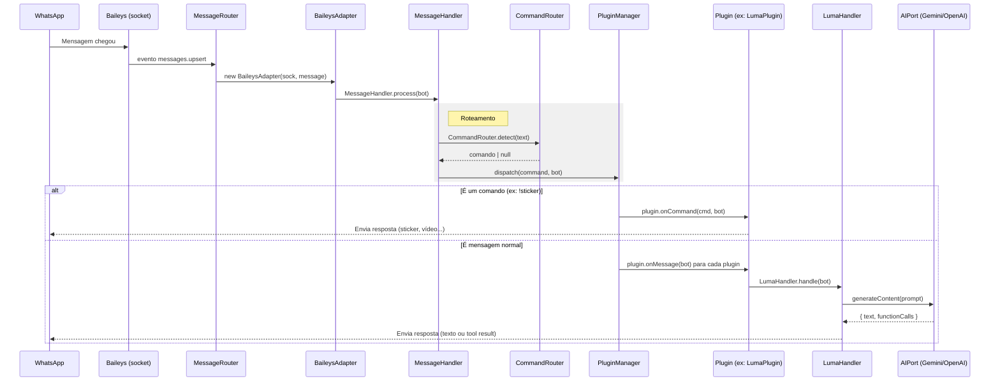

# Arquitetura do Sistema

O LumaBot v7.0 implementa **Arquitetura Hexagonal (Ports & Adapters)** com **Plugin System** e **Injeção de Dependências**. Esta página descreve os fluxos reais de dados, os design patterns adotados e o raciocínio por trás de cada camada.

---

## Fluxo de Processamento (Pipeline Principal)



---

## Camadas da Arquitetura

### Core — Domínio Puro

`src/core/` não importa nada externo. É o coração sem dependências.

**Ports** (`src/core/ports/`) definem contratos:

```js
// AIPort.js — qualquer provider de IA deve implementar estes métodos
export const AIPort = {
  methods: ['generateContent', 'getStats'],
};
```

**Services** (`src/core/services/`) contêm lógica de domínio reutilizável:

| Serviço | Responsabilidade |
|---------|-----------------|
| `CommandRouter` | Parseia texto → constante de comando |
| `ConversationHistory` | Histórico por JID com limpeza automática |
| `PromptBuilder` | Monta o array `contents` no formato Gemini-style |
| `AIProviderFactory` | Cria o provider certo baseado em `env.AI_PROVIDER` |
| `GroupService` | Operações de grupo (isAdmin, mentionAll) |
| `UserResolver` | Resolve JID → melhor nome humano; apelidos manuais |
| `ReminderService` | Valida e persiste lembretes; normaliza linhas do banco |

### Adapters — Implementações Concretas

`src/adapters/` contém código específico de tecnologia. Cada adapter implementa um port.

```
adapters/
├── ai/
│   ├── GeminiAdapter.js       → implementa AIPort (fallback entre modelos, tool calling)
│   └── OpenAIAdapter.js       → implementa AIPort (OpenAI + DeepSeek-compatible)
├── search/
│   ├── TavilyAdapter.js       → implementa SearchPort
│   └── GoogleGroundingAdapter.js
├── storage/
│   ├── SQLiteStorageAdapter.js    → implementa StoragePort (produção)
│   └── InMemoryStorageAdapter.js  → implementa StoragePort (testes)
└── transcriber/
    └── GeminiTranscriberAdapter.js → implementa TranscriberPort
```

**Regra:** o código de domínio nunca menciona Gemini, SQLite ou Baileys. Ele fala com ports.

> **Nota sobre `ConversationHistory`:** em grupos, o histórico é indexado pela chave composta `groupJid:senderJid` (calculada no `LumaPlugin`), garantindo que cada pessoa tenha seu próprio fio de conversa. Em chats privados a chave continua sendo o `remoteJid`. O `PersonalityManager` continua usando o `groupJid` — personalidade é uma configuração do grupo, não individual.

### Infra — Wiring e Infraestrutura

`src/infra/` conecta tudo:

| Arquivo | Responsabilidade |
|---------|-----------------|
| `Container.js` | DI container — registra factories, resolve como lazy singleton |
| `Bootstrap.js` | Instancia adapters, registra no Container, inicia ConnectionManager |
| `BaileysSocketFactory.js` | Cria o socket Baileys com configuração correta |
| `MessageRouter.js` | Recebe `messages.upsert`, aplica rate limit por JID e sanitização, cria BaileysAdapter, enriquece perfis via `UserResolver`, chama MessageHandler |
| `JidQueue.js` | Fila por JID — serializa o mesmo chat, paraleliza chats distintos |
| `ReminderScheduler.js` | Loop de 30s que dispara lembretes vencidos (sobrevive a reinícios) |
| `QrCodePresenter.js` | Exibe QR no terminal e emite sinal `[LUMA_QR]:...` para o dashboard |
| `ReconnectionPolicy.js` | **Decide** o que fazer após desconexão (sem executar — só retorna a ação) |

A separação entre `ReconnectionPolicy` (decide) e `ConnectionManager` (executa) é intencional: permite testar a lógica de decisão sem simular reconexões reais.

### Plugins — Features Plug-n-Play

Cada plugin é um módulo auto-contido. Adicionar ou remover um plugin não requer tocar em outros arquivos além do registro em `MessageHandler.js`.

**Contrato de Plugin:**

```js
export class MeuPlugin {
  // Comandos que este plugin trata (opcional)
  static commands = [COMMANDS.MEU_COMANDO];

  // Chamado quando CommandRouter detecta um dos commands acima
  async onCommand(command, bot) { ... }

  // Chamado para TODA mensagem (use com moderação)
  async onMessage(bot) { ... }
}
```

**Plugins ativos:**

Registrados em `MessageHandler.js`, nesta ordem:

| Plugin | Comandos / Triggers |
|--------|---------------------|
| `MediaPlugin` | `!sticker`, `!image`, `!gif` |
| `DownloadPlugin` | `!download` |
| `AudioDownloadPlugin` | `!audio`, `!a` |
| `GroupToolsPlugin` | `@everyone`, easter eggs |
| `LumaPlugin` | trigger "luma", áudio, `!persona`, `!luma clear`, `!luma stats` |
| `SpontaneousPlugin` | nenhum trigger — escuta `onMessage` |
| `UtilsPlugin` | `!help`, `!meunumero` |
| `ResumoPlugin` | `!resumo` |
| `UserPlugin` | `!nick`, `!apelido` |
| `RankPlugin` | `!rank`, `!rank global` |
| `ReminderPlugin` | `!lembrete` (alias `!lembrar`) |

---

## Design Patterns em Uso

### 1. Hexagonal (Ports & Adapters)

```
Domínio fala com → AIPort (interface)
GeminiAdapter   → implementa AIPort
OpenAIAdapter   → implementa AIPort  ← trocar provider: zero mudança no domínio
```

### 2. Injeção de Dependência via Construtor

```js
// ConnectionManager recebe ReconnectionPolicy — não a instancia
constructor() {
  this.policy = new ReconnectionPolicy(CONFIG);
}

// LumaHandler aceita aiService e history injetados (facilita testes)
constructor({ aiService, history } = {}) {
  this.aiService = aiService ?? createAIProvider(env);
  this.history   = history   ?? new ConversationHistory();
}
```

### 3. Separação de Decisão e Execução

`ReconnectionPolicy.decide(statusCode, errorMessage)` retorna `'reconnect' | 'clean_and_restart' | 'regenerate_qr' | ...`

`ConnectionManager.handleDisconnection()` recebe esse valor e age. Nenhum dos dois conhece a lógica do outro.

### 4. Facade (BaileysAdapter)

`BaileysAdapter` normaliza o protocolo do Baileys num objeto `bot` com getters limpos:

```js
bot.body                  // texto da mensagem
bot.jid                   // JID do chat (grupo ou privado)
bot.senderJid             // JID de quem enviou (≠ bot.jid em grupos; LID-compatível)
bot.isGroup               // é grupo?
bot.hasVisualContent      // tem imagem/sticker na mensagem atual?
bot.quotedText            // texto da mensagem citada (null se não há citação)
bot.quotedHasVisualContent // mensagem citada contém imagem ou sticker?
bot.quotedHasAudio        // mensagem citada contém áudio?
bot.quotedSenderName      // autor da citação: "Luma" | nome do remetente | "Alguém"
bot.reply(text)           // responde com quote
bot.react(emoji)          // reage
bot.sendPresence('composing')  // "digitando..."
```

O restante do sistema não sabe que o Baileys existe.

---

## Fluxos Detalhados

### Cenário 1: "luma, qual o clima hoje?"

```
1. Baileys → MessageRouter → BaileysAdapter → MessageHandler
2. CommandRouter.detect() → null (não é comando)
3. PluginManager.dispatch(null, bot) → chama onMessage em todos os plugins
4. LumaPlugin.onMessage(bot):
   a. Adiciona mensagem ao #groupBuffer (se grupo)
   b. LumaHandler.isTriggered(text) → true
   c. historyKey = groupJid:senderJid (grupo) | jid (privado)
   d. LumaHandler.handle(bot, isReply, groupContext, historyKey)
5. LumaHandler:
   a. ConversationHistory.getText(historyKey) → histórico do interlocutor
   b. PersonalityManager.getPersonaConfig(bot.jid) → persona do grupo
   c. PromptBuilder.buildPromptRequest({...}) → contents[]
   d. aiService.generateContent(contents) → { text, functionCalls }
   e. functionCalls inclui search_web? → WebSearchService.search(query)
   f. cleanResponseText(text) → texto limpo (remove <think>, "Luma:", [PARTE])
   g. history.add(historyKey, pergunta, resposta, nome)
6. _sendParts(bot, parts) → envia em partes se necessário
```

### Cenário 2: "!sticker" com imagem

```
1. BaileysAdapter → MessageHandler
2. CommandRouter.detect('!sticker') → '!sticker'
3. PluginManager.dispatch('!sticker', bot)
4. MediaPlugin.onCommand('!sticker', bot):
   a. Detecta mídia na mensagem ou na mensagem quotada
   b. MediaProcessor.downloadMedia(raw, sock) → Buffer
   c. ImageProcessor.createSticker(buffer) ou VideoConverter
   d. bot.socket.sendMessage(jid, { sticker: buffer })
```

### Cenário 3: Interação Espontânea (sem trigger)

```
1. Mensagem de grupo chega
2. PluginManager.dispatch(null, bot) → onMessage
3. SpontaneousPlugin.onMessage(bot):
   a. Cooldown ok? (≥ 8 min desde última interação no grupo)
   b. Sorteio de chance:
      - grupo quieto: 4%
      - grupo ativo (≥ 8 msgs/2 min): 10%
      - mensagem visual: 15%
   c. Passou? → Sorteia tipo: react (35%) | reply (35%) | topic (30%)
4. LumaHandler gera resposta para reply/topic
```

### Cenário 4: Bot desconecta

```
1. connection.update → connection = 'close'
2. ConnectionManager.handleDisconnection(lastDisconnect)
3. ReconnectionPolicy.decide(statusCode, errorMessage):
   - 408/440 ou "timed out" → 'regenerate_qr' (ou 'qr_max_reached' se > 5 tentativas)
   - 503/500 ou "Connection Failure" → 'retry_connection'
   - 405/401/403 → 'clean_and_restart' (limpa sessão)
   - loggedOut → 'clean_and_restart'
   - qualquer outro → 'reconnect' (com backoff exponencial até 15s)
4. ConnectionManager executa a ação correspondente
```

---

## Multi-Provider de IA

A troca de provider é feita apenas via variável de ambiente:

```env
AI_PROVIDER=gemini    →  AIService via GeminiAdapter
AI_PROVIDER=openai    →  OpenAIAdapter (GPT-4o, GPT-4o-mini)
AI_PROVIDER=deepseek  →  OpenAIAdapter com baseURL DeepSeek
```

`AIProviderFactory.createAIProvider(env)` encapsula essa decisão. O `LumaHandler` recebe o provider via DI e não sabe qual é.

**Formato de tools:** Gemini usa `{ functionDeclarations: [...] }`. OpenAI/DeepSeek usa `{ type: 'function', function: {...} }`. O `OpenAIAdapter.#convertTools()` faz a conversão automaticamente.

---

## Diagrama de Dependências (Atual)

```
index.js
  └── ConnectionManager
        ├── BaileysSocketFactory      (cria o socket)
        ├── QrCodePresenter           (exibe QR)
        ├── contacts.upsert/update    → UserResolver (enriquece wa_users)
        ├── ReminderScheduler         (dispara lembretes vencidos a cada 30s)
        ├── MessageRouter             (roteia eventos; UserResolver enriquece perfis)
        │     └── MessageHandler
        │           └── PluginManager
        │                 ├── LumaPlugin → LumaHandler → AIProviderFactory → GeminiAdapter/OpenAIAdapter
        │                 │                          ├── ConversationHistory
        │                 │                          └── ToolDispatcher → (tag_everyone, remove_member,
        │                 │                                create_*, search_web, schedule_reminder...)
        │                 ├── MediaPlugin → MediaProcessor → ImageProcessor/VideoConverter
        │                 ├── DownloadPlugin / AudioDownloadPlugin → VideoDownloader
        │                 ├── SpontaneousPlugin → SpontaneousHandler
        │                 ├── GroupToolsPlugin → GroupManager
        │                 ├── ResumoPlugin
        │                 ├── UserPlugin → UserResolver (apelidos)
        │                 ├── RankPlugin → DatabaseService (luma_interactions) + UserResolver
        │                 ├── ReminderPlugin → ReminderService
        │                 └── UtilsPlugin
        └── ReconnectionPolicy        (decide ações, não executa)
```

Zero dependências circulares. Cada módulo conhece apenas os módulos abaixo de si.

---

**Próximo passo:** [02-nucleo-ia.md](./02-nucleo-ia.md) — como a IA funciona internamente.
